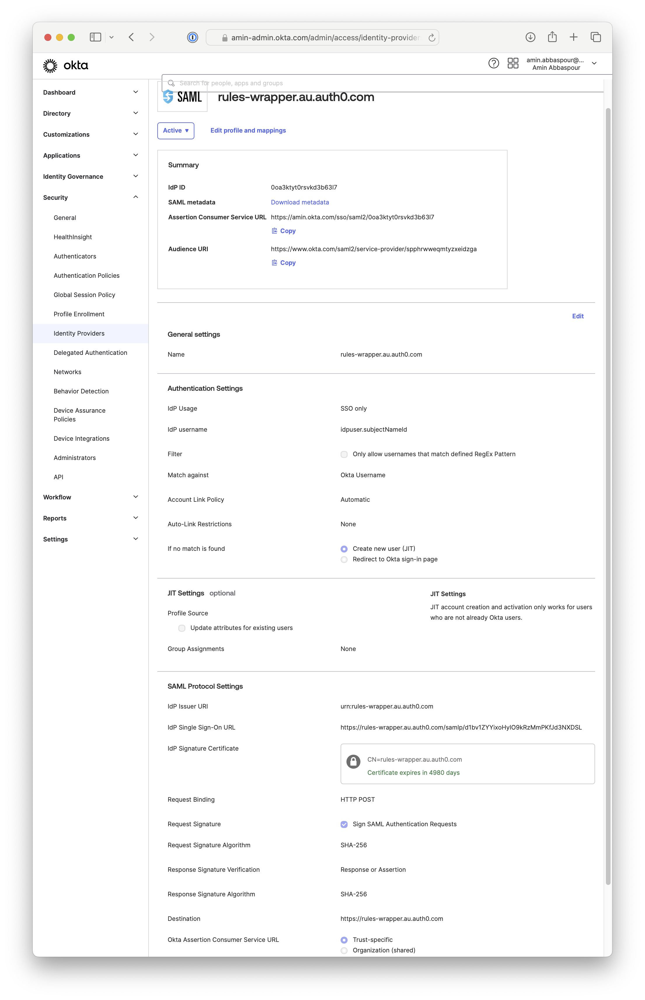
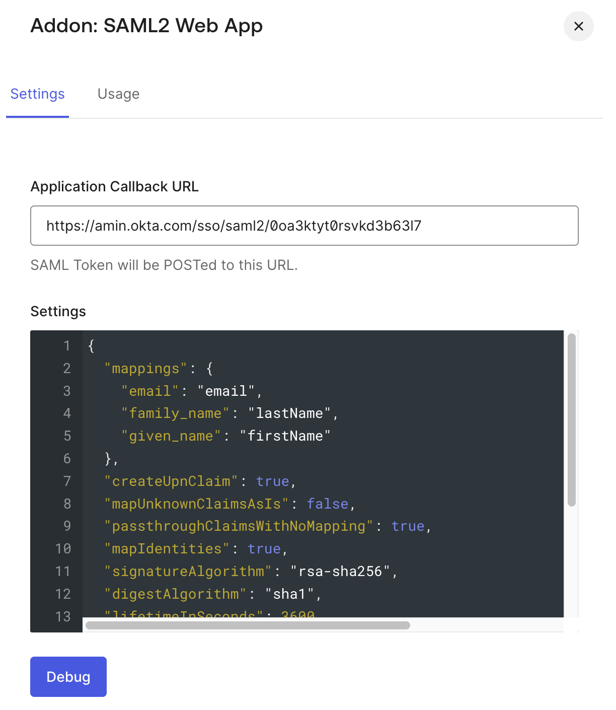

# Setup

## Okta as SP
Admin > Security > Identity Providers > Add > SAML 2.0 IdP > 

* IdP Issuer URI: `urn:{tenant}.{region}.auth0.com`
* IdP Single Sign-On URL: `https://{tenant}.{region}.auth0.com/samlp/{auth0-idp-app-id}`
* IdP Signature Certificate: `https://{tenant}.{region}.auth0.com/pem`
* IdP metadata: `https://{tenant}.{region}.auth0.com/samlp/metadata/{auth0-idp-app-id}`




## Auth0 as IdP

> :warning: User profile in Auth0 should have `email`, `given_name` and `family_name` attributes

Manage > Applications > SAML IdP App > Addons > SAML2 Web App > Settings

* ACS: `https://{org_name}.okta.com/sso/saml2/${okta-idp-id}`

```json
{
  "mappings": {
    "email": "email",
    "family_name": "lastName",
    "given_name": "firstName"
  },
  "createUpnClaim": true,
  "mapUnknownClaimsAsIs": false,
  "passthroughClaimsWithNoMapping": true,
  "mapIdentities": true,
  "signatureAlgorithm": "rsa-sha256",
  "digestAlgorithm": "sha1",
  "lifetimeInSeconds": 3600,
  "nameIdentifierFormat": "urn:oasis:names:tc:SAML:1.1:nameid-format:unspecified",
  "nameIdentifierProbes": [
    "http://schemas.xmlsoap.org/ws/2005/05/identity/claims/emailaddress"
  ],
  "typedAttributes": true,
  "includeAttributeNameFormat": true
}
```


